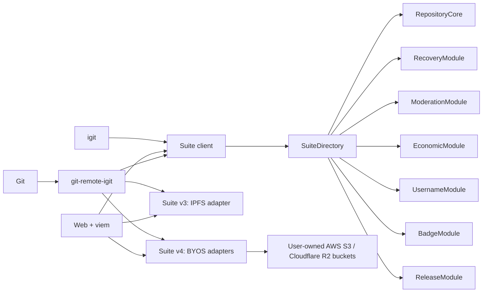
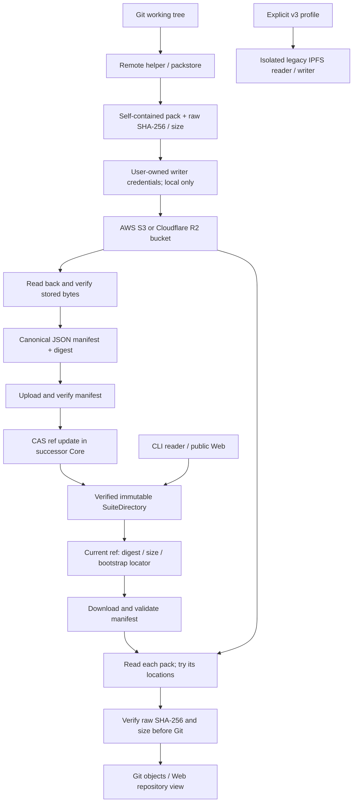

# 不可变 EVM 套件架构

范围更新：2026-10-05（Asia/Shanghai）。Suite v4（BYOS 后继）已在
`contracts/evm-v2-successor` 实现，部署并激活于 Injective 测试网，CLI/Web
经链上版本分派访问；真实 Cloudflare R2 端到端 Git 流程 PASS。2026-09-13
的审计事实仍绑定于[审计基线](reconciliation-baseline-2026-09-12.md)。仍
开放：真实 AWS S3 canary、Foundry 门禁、后继发布证据与主网审批。
首个主网目标由 [ADR 0004](adr/0004-mainnet-storage-neutral-successor-and-byos-scope.md)
固定：存储中立后继上的用户自有 AWS/R2 存储桶，不做仅 IPFS 的 v3 上线。

## 当前实现：EVM V2 世代，套件版本 3 与 4

普通产品代码路径是 EVM V2。网络 profile 包含端点、chain ID 与一个
`SuiteDirectory` 地址。CLI、普通 Web 仓库路径与 `git-remote-igit` 都从该
Directory 解析全部当前合约，且除非其链上 `suiteVersion()` 为 3 或 4、处于
激活状态、代码哈希验证通过且内部绑定正确，否则 fail-closed。版本 3 分派
到冻结的 IPFS 路径；版本 4 分派到 BYOS manifest 承诺路径（见
[套件版本兼容矩阵](suite-version-compatibility.md)）。Web 另有独立、显式
的 CosmWasm V1 归档查看器用于历史只读查阅；该查看器不是另一个
SuiteDirectory，也不参与普通 Git 操作。
EVM V2 是产品世代名；套件版本 3（IPFS）与 4（BYOS 后继）是协议版本，
不是可选的 Cosmos/EVM 运行时。

这是 EVM V2 产品世代的原因：CosmWasm V1 在 Windows 上要求 WSL2 承载的
Push 工具链，而 Linux 原生运行。EVM 路径把 WSL2 与 `injectived` 从普通
Windows 与 Linux 前置条件中移除。见
[ADR 0001](adr/0001-evm-v2-runtime-and-migration-scope.md)。

`RepositoryCore` 拥有稳定的仓库 ID、canonical 与历史定位符、元数据、ref、
协作者、转让与 fork 谱系。`RecoveryModule` 拥有守护人提案，是 Core 接受的
唯一恢复能力。`ModerationModule` 拥有举报、申诉、痕迹与强制策略钩子。
`EconomicModule` 只以原生 INJ 接受新赞助，同时保留按历史面额可查询的迁移
总额。其余模块拥有用户名、不可转让徽章与不可变的发布哈希。

没有任何套件合约可升级。没有代理、diamond 或 `delegatecall`。Directory
配置是一次性的，激活后即冻结。

## 交易

Go 写入都经过同一个 `EVMTransactor`：链校验、pending nonce、gas 估算、
legacy type-0 签名、最低 `160000000 wei` gas price、广播与有界的两分钟
回执轮询。最终回执未知的广播会返回含交易哈希的类型化错误并使本地 nonce
状态失效。Web 使用 viem，遵循同样的显式 gas/类型规则并检查回执成功。
Injective EVM 支持 EIP-1559，但在有一笔已出资、已签名、已出块且回执被
保留的 canary 之前，本项目不把任一发送方切到 type 2。

## Bootstrap

`BootstrapCoordinator` 绑定完整快照根，并按固定顺序导入 Core、Recovery、
Moderation、Economic、Username、Badge 与 Release。每批有界数量与字节数、
序列、载荷哈希与滚动承诺。每个模块在预期计数/根验证后恰好终结一次。此后
协调者才能原子地激活 Directory。

## V1 边界

历史链访问存在于 `archive/cosmwasm-v1`、只读的 `igit archive` 命令与显式
Web 路由 `/archive/cosmwasm-v1`。该 Web 路由使用仅 GET 的智能查询适配器
与每会话快照高度。它绝不签名或广播 CosmWasm 消息，也不是 EVM 套件验证
失败时的普通 Web 回退。EVM V2 仍是唯一的 `SuiteDirectory` 信任根与唯一
可写的产品路径。快照证据是固定高度、区块哈希绑定、清单完整、可供审计
工具使用的。按 [ADR 0003](adr/0003-fresh-evm-suite-and-v1-archive-preview.md)
接受的当前范围，它不构成套件 bootstrap 计划：EVM 套件从空状态启动，V1
保持仅预览。

## 首个主网目标：存储中立后继（已作为 Suite v4 交付）

Git pack 存储是可替换的数据平面，不是控制平面信任根。Suite v3 只支持
`ipfs://`，因此 Kubo/IPFS 仍是冻结的 v3 旧适配器。Suite v4 是已交付的
BYOS 后继：AWS S3 与 Cloudflare R2 是仅有的首期 provider，按仓库经用户
自有存储桶选择；它们不是 IPFS 网关的别名。对象存储路径不探测、也不依赖
Kubo、IPFS 网络或 iGit 的复制/网关服务。

因为套件合约不可变，存储中立承诺是一个全新的后继套件
（`contracts/evm-v2-successor`，`suiteVersion = 4`），已部署并激活于
Injective 测试网；v3 合约、ABI 与部署证据原封不动。全新后继不要求导入
历史；迁移既有 v3 历史是单独获批的范围。既有的 v3 地址、ABI 与部署证据
不得改标为后继证据。

### 数据流（已在 v4 测试网套件部署；AWS canary 待完成）

数据先于 ref 是客户端规则：链无法抓取云对象，也无法证明未来可用性。BYOS
不引入 iGit broker 或强制的存储回执签名者。桶所有者承担 provider 费用与
可用性风险；初始阶段一个已验证位置即足够。

### 承诺模型

| 对象 | 职责 |
|---|---|
| 链上 ref 状态 | 仓库/ref/提交、manifest SHA-256 与大小、有界稳定引导定位符、协议/revision、作者/时间与 CAS |
| PackManifest | 链/套件/仓库/ref/提交上下文加有序 pack 列表；以 canonical JSON 编码 |
| PackEntry | 原始字节 SHA-256、精确大小、pack 版本、序号、thin/依赖信息 |
| PackLocation | 同一 PackEntry 的备用位置；不是额外的顺序 pack |
| 本地 profile | provider 配置与独立的写入者/读取者凭据引用；普通 JSON 中绝不出现机密值 |

在用户控制的前缀下使用摘要派生键，如 `packs/sha256/<digest>.pack` 与
`manifests/sha256/<digest>.json`。manifest 摘要位于其自身被哈希的 body
之外。增加位置或修改 pack 字节都会产生新 manifest；同提交更新仍需要新的
CAS revision。自包含非 thin pack 是初始后继策略。

详细的 [BYOS 实施规格](storage-byos.md) 定义了 JCS 跨语言向量、引导发现、
整数/字节限额、端点限制、provider 能力、失败恢复与具体代码位置。这些
线上细节已冻结（manifest schema 1）并由已检入的 v4 ABI/解码器实现；把它
们当作不可变协议，而不是开放设计。

### 访问与兼容性不变量

- 首期云 provider 仅用户自有的 AWS S3 与 Cloudflare R2。MinIO、其他云、
  通用 S3 兼容 API 与自建对象存储不是被接受的生产 profile。云背书的公开
  读域名不是自建写入 provider。
- 仓库是公开的。标准 Web 访问使用稳定的匿名 HTTPS 与 CORS；认证桶读取
  使用用户独立配置的 CLI 读取者凭据，而不是共享写入机密或托管 broker。
  私有桶不等于私有仓库/加密实现。
- 已发布字节按协议不可变，即使云管理员可以覆写/删除对象。客户端检测这种
  损坏；摘要无法恢复缺失字节，也不保证持久性。
- 任何凭据、会话令牌或预签名 URL 都不进入链上状态、manifest、Git remote、
  日志或浏览器存储。公开定位符是显式公开的。
- 不要把旧版 v3 PackURI 与后继承诺混进同一个隐式 `string[]` 路径。未知
  套件/manifest 版本在上传前 fail-closed。
- 旧版 CID 校验不等于链绑定的原始 pack 摘要：v3 不包含后者。下载后算出
  的哈希不能创造缺失的真实性证据。在适配器/测试中保留这一区别。
- 冷读取必须仅凭合约状态查询即可完成，不依赖事件索引器。ABI/索引器检查点
  需要独立的版本/重组校验；基线中已标记 FAIL 的四个脚本不得启用。
- 保留 V1 归档隔离、Directory 代码哈希检查与模块所有权/治理/恢复职责。
  一起评审后继 ref CAS、删除/重建、fork 上下文、bootstrap 与事件 schema。

见 [ADR 0002](adr/0002-pluggable-pack-storage.md)、
[ADR 0004](adr/0004-mainnet-storage-neutral-successor-and-byos-scope.md)
与[下一实施任务书](prompts/next-storage-implementation.md)。

见[迁移](evm-v2-migration.md)、[发布](release.md)与现行
[交付路线图](delivery-roadmap.md)。

存储代码位于 `cli/internal/packmanifest`、`packstore`、`storageconfig`、
`safehttp` 与 `cli/internal/byos`（v4 remote 路径），TypeScript 侧的
manifest 对等实现在 `web/src/lib/packmanifest.ts`，已验证的后继读取器在
`web/src/lib/successorReader.ts`。remote helper 与 Web gitstore 按套件
版本分派：v3 保持 IPFS 路径不变，v4 经已验证的 manifest/BYOS 路径
push/fetch 并带 CAS ref 更新。见
[BYOS 实现与限额](storage-byos.md#9-s01s03-本地实现与可重复验证2026-09-13)
与[套件版本兼容矩阵](suite-version-compatibility.md)。
