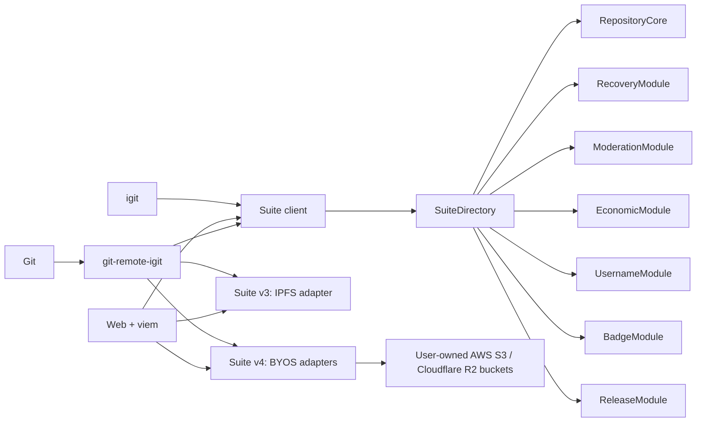
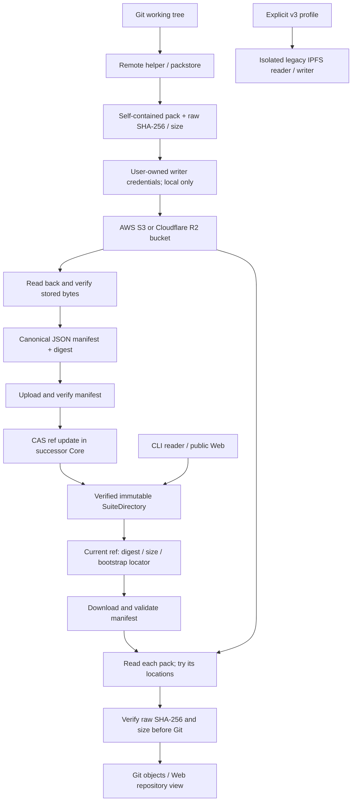

# Immutable EVM Suite Architecture

Scope updated: 2026-10-05 (Asia/Shanghai). Suite v4 (BYOS successor) is
implemented in `contracts/evm-v2-successor`, deployed and active on Injective
testnet, and reached by CLI/Web through on-chain version dispatch; real
Cloudflare R2 end-to-end Git flows PASS. The 2026-09-13 audit facts remain
bound to the [audit baseline](reconciliation-baseline-2026-09-12.md). Still
open: real AWS S3 canary, Foundry gates, successor publication evidence, and
mainnet approval.
The first mainnet target is fixed by [ADR 0004](adr/0004-mainnet-storage-neutral-successor-and-byos-scope.md):
user-owned AWS/R2 buckets on a storage-neutral successor, not an IPFS-only v3 launch.

## Current Implementation: EVM V2 Generation, Suite Versions 3 And 4

The ordinary product code path is EVM V2. A network profile contains endpoints,
chain ID, and one `SuiteDirectory` address. CLI, the ordinary Web repository
path, and `git-remote-igit` resolve all current contracts from that Directory
and fail closed unless its on-chain `suiteVersion()` is 3 or 4, it is active,
code-hash verified, and internally bound. Version 3 dispatches to the frozen
IPFS path; version 4 dispatches to the BYOS manifest-commitment path (see
[suite version compatibility](suite-version-compatibility.md)). The Web also
exposes a separate, explicit CosmWasm V1 archive viewer for historical
read-only inspection; that viewer is not an alternate SuiteDirectory and does
not participate in ordinary Git operations.
EVM V2 is a product-generation name; Suite versions 3 (IPFS) and 4 (BYOS
successor) are protocol versions, not alternative Cosmos/EVM runtimes.

This is the EVM V2 product generation because CosmWasm V1 required a WSL2-hosted
Push toolchain on Windows while Linux ran natively. The EVM path removes WSL2
and `injectived` from ordinary Windows and Linux prerequisites. See
[ADR 0001](adr/0001-evm-v2-runtime-and-migration-scope.md).

`RepositoryCore` owns stable repo IDs, canonical and historical locators,
metadata, refs, collaborators, transfer, and fork lineage. `RecoveryModule`
owns guardian proposals and is the only recovery capability accepted by Core.
`ModerationModule` owns reports, appeals, trails, and mandatory policy hooks.
`EconomicModule` accepts new sponsorship only in native INJ while retaining
queryable migrated totals by historical denomination. The remaining modules
own usernames, non-transferable badges, and immutable release hashes.

No Suite contract is upgradeable. There are no proxies, diamonds, or
`delegatecall`. Directory configuration is one-shot and activation freezes it.

## Transactions

Go writes pass through one `EVMTransactor`: chain validation, pending nonce,
gas estimate, legacy type-0 signing, minimum `160000000 wei` gas price,
broadcast, and bounded two-minute receipt polling. A broadcast whose final
receipt is unknown returns a typed error containing the transaction hash and
invalidates local nonce state. Web uses viem with the same explicit gas/type
rules and checks receipt success. Injective EVM supports EIP-1559, but this
project does not switch either sender to type 2 until a funded signed canary is
mined and its receipt is retained.

## Bootstrap

`BootstrapCoordinator` binds the complete snapshot root and imports Core,
Recovery, Moderation, Economic, Username, Badge, and Release in fixed order.
Each batch has bounded count and bytes, sequence, payload hash, and rolling
commitment. Each module finalizes once after expected count/root verification.
Only then can the coordinator atomically activate the Directory.

## V1 Boundary

Historical chain access exists under `archive/cosmwasm-v1`, the read-only
`igit archive` command, and the explicit Web route `/archive/cosmwasm-v1`.
The Web route uses a GET-only smart-query adapter and a per-session snapshot
height. It never signs or broadcasts CosmWasm messages, and it is not an
ordinary Web fallback when EVM Suite verification fails. EVM V2 remains the
sole `SuiteDirectory` trust root and the only write-capable product path.
Snapshot evidence is fixed-height, block-hash bound, inventory complete, and
available for audit tooling. Under the accepted current scope in
[ADR 0003](adr/0003-fresh-evm-suite-and-v1-archive-preview.md), it does not become
a Suite bootstrap plan: the EVM Suite starts empty and V1 remains preview-only.

## First Mainnet Target: Storage-Neutral Successor (Delivered As Suite v4)

Git pack storage is a replaceable data plane, not the control-plane trust root.
Suite v3 supports only `ipfs://`, so Kubo/IPFS remains the frozen legacy v3
adapter. Suite v4 is the delivered BYOS successor: AWS S3 and Cloudflare R2
are the only first-release providers, selected per repository through
user-owned buckets; they are not aliases for an IPFS gateway. The
object-storage path does not probe or require Kubo, the IPFS network, or the
iGit replication/gateway services.

Because Suite contracts are immutable, the storage-neutral commitment is a new
successor Suite (`contracts/evm-v2-successor`, `suiteVersion = 4`), deployed
and active on Injective testnet; v3 contracts, ABIs, and deployment evidence
are untouched. A fresh successor does not require history import; migrating
existing v3 history is a separate approved scope. Existing v3 addresses, ABIs
and deployment evidence must not be relabeled as successor evidence.

### Data Flow (Deployed On The v4 Testnet Suite; AWS Canary Pending)

Data-before-ref is a client rule: the chain cannot fetch a cloud object or
prove future availability. BYOS introduces no iGit broker or mandatory
storage-receipt signer. Bucket owners bear provider costs and availability
risk; one verified location is sufficient initially.

### Commitment Model

| Object | Responsibility |
|---|---|
| On-chain ref state | Repo/ref/commit, manifest SHA-256 and size, bounded stable bootstrap locator, protocol/revision, author/time and CAS |
| PackManifest | Chain/Suite/repo/ref/commit context plus an ordered list of packs; encoded as canonical JSON |
| PackEntry | Raw-byte SHA-256, exact size, pack version, sequence, thin/dependency information |
| PackLocation | Alternative locations for the same PackEntry; not additional sequential packs |
| Local profile | Provider configuration and independent writer/reader credential references, never secret values in ordinary JSON |

Use digest-derived keys such as `packs/sha256/<digest>.pack` and
`manifests/sha256/<digest>.json` under a user-controlled prefix. The manifest
digest is outside its own hashed body. Adding a location or changing pack
bytes creates a new manifest; a same-commit update still requires a new CAS
revision. Self-contained non-thin packs are the initial successor policy.

The detailed [BYOS specification](storage-byos.md) defines JCS cross-language
vectors, bootstrap discovery, integer/byte limits, endpoint restrictions,
provider capabilities, failure recovery and concrete code locations. Those
wire details are frozen (manifest schema 1) and implemented by the checked-in
v4 ABI/decoders; treat them as immutable protocol, not open design.

### Access And Compatibility Invariants

- Only user-owned AWS S3 and Cloudflare R2 are first-release cloud providers.
  MinIO, other clouds, generic S3-compatible APIs and self-hosted object stores
  are not accepted production profiles. A cloud-backed public read domain is
  not a self-hosted write provider.
- Repositories are public. Standard Web access uses stable anonymous HTTPS
  and CORS; authenticated bucket reads use independent user-configured CLI
  reader credentials, not writer-secret sharing or a hosted broker. A private
  bucket is not a private-repository/encryption implementation.
- Published bytes are immutable by protocol, even if a cloud administrator
  can overwrite/delete objects. Clients detect that damage; a digest cannot
  recover missing bytes or guarantee persistence.
- No credential, session token or presigned URL enters chain state, manifest,
  Git remote, logs or browser storage. Public locators are explicitly public.
- Do not mix legacy v3 PackURIs and successor commitments in one implicit
  `string[]` path. Unknown Suite/manifest versions fail closed before uploads.
- Legacy CID verification is not the same as a chain-bound raw-pack digest:
  v3 does not contain the latter. A hash computed after download cannot create
  missing authenticity evidence. Preserve that distinction in adapters/tests.
- Contract state queries must suffice for cold reads without an event indexer.
  ABI/indexer checkpoints need independent version/reorg validation; the four
  existing scripts marked FAIL in the baseline must not be enabled.
- Preserve V1 archive isolation, Directory code-hash checks and module
  ownership/moderation/recovery responsibilities. Review successor ref CAS,
  delete/recreate, fork context, bootstrap and event schemas together.

See [ADR 0002](adr/0002-pluggable-pack-storage.md),
[ADR 0004](adr/0004-mainnet-storage-neutral-successor-and-byos-scope.md), and
the [next implementation prompt](prompts/next-storage-implementation.md).

See [migration](evm-v2-migration.md), [release](release.md), and the active
[delivery roadmap](delivery-roadmap.md).

Storage code lives under `cli/internal/packmanifest`, `packstore`,
`storageconfig`, `safehttp`, and `cli/internal/byos` (v4 remote path), with
TypeScript manifest parity in `web/src/lib/packmanifest.ts` and the verified
successor reader in `web/src/lib/successorReader.ts`. The remote helper and
Web gitstore dispatch by suite version: v3 keeps the IPFS path unchanged, v4
pushes/fetches through the verified manifest/BYOS path with CAS ref updates.
See [BYOS implementation and limits](storage-byos.md#9-s01s03-本地实现与可重复验证2026-09-13)
and [suite version compatibility](suite-version-compatibility.md).
