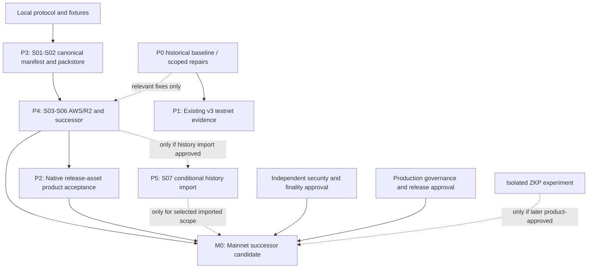

# Delivery Roadmap

2026-10-05 delivery update: Suite v4 (BYOS) is delivered. S01–S06 are recorded
in [backlog](backlog.md) — successor suite deployed and active on Injective
testnet (`0xf987396475d0a4c96b722e993a95d8720a6292ad`), CLI/Web version
dispatch, real Cloudflare R2 end-to-end Git flows and Web reads PASS without
Kubo/WSL2/`injectived`. Remaining NOT PROVEN: real AWS S3 canary, force-push
stale/concurrent real-world races, Blockscout verification, Foundry gates
(R04), successor publication evidence, security review, and mainnet approval.

- Product acceptance status: NOT PROVEN; this document is an execution plan
- Initial assessment: 2026-08-15
- Scope update: 2026-09-13 (Asia/Shanghai), user-confirmed AWS S3 / R2 BYOS
- Current fact baseline: [2026-09-13 audit](reconciliation-baseline-2026-09-12.md), source `0ba06f436558f12d97625b393767440cdd0f9862`
- Historical Suite evidence anchor: `4fd6a07ad2f45eb4b0b09b58eeed1621ddc8f986` (HISTORICAL, not current product approval)
- Mainnet target: Storage-neutral successor with user-owned AWS S3 / R2 buckets
- Public built-in Directory profiles remain empty; local Web overrides are documented in the baseline
- Quick overview: See [Project Status](project-status.md) for a high-level summary

> [!IMPORTANT]
> This document tracks sequencing, dependencies, delivery status, and exit
> criteria. It is not deployment evidence. A milestone is not complete until
> its commit-bound evidence passes the gates in
> [Release And Cutover](release.md) and
> [Acceptance Evidence](acceptance-evidence.md).

## Purpose And Document Boundaries

This is the execution hub for the next product phases: a usable Injective EVM
control plane, native Windows operation without WSL2, pluggable Amazon S3 and
Cloudflare R2 pack storage, and an isolated Injective testnet ZKP prototype.

The surrounding documents retain their narrower authority:

| Document | Authority |
|---|---|
| [ADR 0001](adr/0001-evm-v2-runtime-and-migration-scope.md) | Accepted EVM V2 runtime, immutable Suite, migration, and platform decisions |
| [ADR 0002](adr/0002-pluggable-pack-storage.md) | Accepted direction and required properties for pluggable pack storage |
| [ADR 0003](adr/0003-fresh-evm-suite-and-v1-archive-preview.md) | Accepted fresh-empty Suite and V1 archive-preview-only cutover scope |
| [ADR 0004](adr/0004-mainnet-storage-neutral-successor-and-byos-scope.md) | Confirmed first mainnet successor, AWS/R2 BYOS and public-repository scope |
| [BYOS Specification](storage-byos.md) | Frozen manifest schema, canonical JSON, credentials, provider limits and failure contracts |
| [Suite Version Compatibility](suite-version-compatibility.md) | Authoritative v1–v5+ version dispatch policy for CLI and Web |
| [Architecture](architecture.md) | Current immutable Suite and data-plane boundaries |
| [EVM V2 Migration](evm-v2-migration.md) | Migration workflow, present implementation, and completion definition |
| [Remaining Work](backlog.md) | Granular engineering and policy task inventory |
| [Open Decisions](open-questions.md) | Decisions that require explicit review rather than implementation inference |
| [Release And Cutover](release.md) | Release contents and the cutover gate |
| [Acceptance Evidence](acceptance-evidence.md) | Required real evidence and its binding rules |
| [P0 Evidence Record](p0-evidence.md) | Commit-bound Windows/Linux CI and local P0 verification snapshot |
| [Infrastructure](infrastructure.md) | As-built IPFS data plane; not EVM or object-storage acceptance |
| [CI Path Routing And Web Publishing](ci-web-publishing.md) | Per-tree CI gating and the Web production publish path |

When this roadmap conflicts with an accepted ADR, the ADR wins. When it
conflicts with real cutover evidence, the evidence wins and this roadmap must
be corrected.

## Current Delivery Truth (Scope Updated 2026-09-13)

This is a planning summary of the audit, not a new execution of its checks.
Do not turn old CI, fixtures, source presence or fixed-block observations into
current deployment approval. The existing R01–R08 findings remain unchanged.

| Area | Status | Planning consequence |
|---|---|---|
| Local solc/ABI, Go test/vet, Web checks in the audit | PASS | Limited to the commands and source recorded in the baseline |
| Foundry, native Kubo and ordinary Windows CLI config path in that audit | BLOCKED | Unblock each relevant verification layer; not prerequisites for local storage protocol work |
| Four EVM indexer scripts and claimed Moderation UI completion | FAIL | Do not use those scripts as a reliable storage/reaper implementation |
| Existing v3 deployment/activation evidence | HISTORICAL | Keep explicit legacy testnet compatibility; not successor evidence |
| Real IPFS/replication/Git/write-transaction E2E | NOT PROVEN | Requires corresponding resources, fixes and explicit write scope |
| AWS S3 / R2 BYOS and successor | DELIVERED (testnet scope) | Suite v4 deployed on testnet with version-dispatching CLI/Web; real R2 E2E PASS; finish the real AWS canary and publication/mainnet evidence before any public profile switch |
| Private repositories, other providers and ZKP product integration | NOT PROVEN | Separate future scope, not first-release BYOS gates |
| Mainnet | NOT PROVEN | Direct successor target; no IPFS-only v3 mainnet intermediate release |

The earlier [P0 evidence record](p0-evidence.md) describes a historical
reviewed commit. It does not close the current DACL/Forge/Kubo
findings or substitute for current Windows/Linux release-asset acceptance.
See [Project Status](project-status.md) for the fact summary and
[ADR 0004](adr/0004-mainnet-storage-neutral-successor-and-byos-scope.md) for
product choices. Do not reuse ambiguous old P1 subtask numbers for R01–R08
repairs or S01–S07 storage tasks.

## Non-Negotiable Guardrails

- Do not publish a `SuiteDirectory` until the exact reviewed commit passes the
  full evidence gate.
- Do not add a V1 runtime fallback, mixed control-plane backend, double write,
  proxy, diamond, `delegatecall`, or direct module trust root.
- Do not claim S3 or R2 support from an endpoint, credential, operations
  script, emulator, or roadmap entry alone.
- Do not place cloud credentials, bucket secrets, bearer tokens, presigned
  URLs or private access details on-chain, in manifests, remotes, logs, browser
  storage or ordinary config. Local credential references are not secrets.
- Do not enable self-hosted/unknown S3-compatible production endpoints. Only
  AWS S3 and Cloudflare R2 BYOS are first-release cloud providers.
- Do not make a managed broker, private repositories, dual replicas or history
  import an unapproved prerequisite for the first public BYOS implementation.
- Do not run automatic unpin, object deletion or lifecycle cleanup. A bucket
  administrator can damage availability; changing bytes requires a new
  digest-derived object and an authorized ref commitment.
- Verify pack size and a stable content digest before Git consumes downloaded
  bytes. An ETag is not a portable content digest.
- Do not use ZKP to replace ordinary content hashing. Storage integrity remains
  a direct SHA-256 verification problem.
- Do not integrate a ZKP verifier into the immutable Suite until the product
  statement, public inputs, replay model, setup, and audit requirements have
  been accepted in a successor design.
- Do not treat CI definitions, fixtures, local probes, or old deployments as
  real acceptance evidence.

## Dependency Map

**Object storage is a confirmed mainnet launch requirement.** P4 is mandatory,
not conditional on another product decision. Existing v3 may remain an explicit
IPFS testnet path; publishing it publicly is not a prerequisite to implementing
S01–S03 or validating a fresh successor. No existing v3/V1 history is imported
without a separate approved scope. One verified AWS or R2 location per object
is sufficient; both adapters must receive their own acceptance.

## Milestone Summary

No new release date is promised. Older engineering estimates are not evidence
or a current schedule. Scope concrete PRs after S01; account, review and live
resource delays do not block independent local work.

| ID | Milestone | Status | Exit condition |
|---|---|---|---|
| P0 | Earlier native source/CI baseline | HISTORICAL | Keep commit-bound evidence; recheck relevant current failures independently |
| P1 | Existing v3 testnet product acceptance | NOT PROVEN | Complete its own evidence if that legacy publication is pursued; no mainnet v3 launch |
| P2 | Native Windows/Linux product acceptance | NOT PROVEN | Both BYOS profiles complete clean release-asset Git workflows without Kubo/WSL2/injectived |
| P3 | S01–S02 manifest and verified packstore | PASS (2026-09-13) | Go/TS canonical vectors, streaming and verification tests; explicit legacy boundary — recorded in [BYOS section 9](storage-byos.md) |
| P4 | S03–S06 AWS/R2 and successor | DELIVERED (testnet scope) | Local adapters/protocol/clients delivered; testnet successor + real R2 E2E PASS; finish real AWS canary and publication evidence |
| P5 | S07 optional historical import | NOT PROVEN | Only for approved import scope: byte-preserving mapping, reachability and rollback evidence |
| Z0 | Isolated ZKP experiment | NOT PROVEN | Independent reviewed experiment; not a BYOS prerequisite |
| M0 | First mainnet successor | NOT PROVEN | P4/P2 and scope-appropriate import evidence, finality, governance, security and approval |

## P0: Windows And EVM Baseline Repair

**Status: HISTORICAL.** The earlier reviewed commit
`f6dcee9aa67255bfdff1867785435022df7ec5e9` is bound to the successful [CI run
32215415044](https://github.com/Hny0305Lin/next-injective-git/actions/runs/32215415044),
including native Windows, Linux, Foundry, race, Kubo, and Web jobs. The local
Windows locale and DACL probes are recorded separately in [P0 Evidence
Record](p0-evidence.md). These historical claims were not re-executed by this
documentation update; the current audit separately records BLOCKED DACL,
Forge and Kubo checks. This record does not satisfy the independent
security review, testnet deployment, migration, wallet, or product cutover
gates.

### Deliverables

The following are the historical P0 control requirements and evidence scope,
not assertions that today's full environment or product acceptance passes:

1. Pin LF for Suite Solidity, ABI JSON, and checked artifact JSON in
   `.gitattributes`. Exercise the artifact gate after a Windows checkout with
   `core.autocrlf=true`.
2. Replace locale-sensitive string assertions with stable error types or codes.
   Test both English and Chinese rendering separately from behavior.
3. Define sensitive-file behavior per platform. POSIX continues to require
   restrictive modes; Windows must apply and test a current-user/SYSTEM DACL
   where secrets are persisted.
4. Replace the stale mainnet RPC default with the current official endpoint
   `https://sentry.evm-rpc.injective.network/` and retain EVM chain ID `1776`.
   Keep testnet on `https://k8s.testnet.json-rpc.injective.network/` with EVM
   chain ID `1439`; do not confuse either value with the Cosmos chain ID.
5. Give every Kubo download source bounded connect, header, idle, and total
   timeouts; add Windows-accessible project mirrors before the public origin.
6. Reconcile transaction documentation with current chain behavior. The
   current [Injective EVM FAQ](https://docs.injective.network/developers-evm/evm-integrations-faq)
   explicitly supports EIP-1559, and both published chain configurations enable
   London from block zero. At the assessment date, read-only testnet calls
   exposed London fee data and accepted type-2 fields for gas estimation. Keep
   the tested legacy type-0 path until a funded, signed type-2 canary is
   broadcast and its receipt is retained.
7. Retain the exact green CI URL and commit binding. The workflow definition
   alone is not evidence; the retained run and local probes are recorded in
   [P0 Evidence Record](p0-evidence.md).

### Exit Criteria

- `go vet ./...` and `go test -count=1 ./...` pass on native Windows and Linux.
- `npm run check` passes from `contracts/evm-v2` on both checkout styles.
- `igit-deploy-suite --check` accepts the exact checked source and artifacts on
  Windows and Linux.
- The PowerShell cutover fixture passes without relying on Bash or WSL2.
- The native Kubo lifecycle reaches a bounded fallback, starts, probes, and
  shuts down without leaving a process or temporary repository.
- The retained CI run is bound to the reviewed commit.

## P1: Suite V3 Testnet Deployment And Cutover

**Product acceptance status: NOT PROVEN.** Existing operator/deployment/activation
records are HISTORICAL. This is an explicit legacy v3 testnet track, not the
first mainnet target or a prerequisite for local BYOS implementation.

### Deliverables

1. **P1.1 / HISTORICAL (2026-08-22):** Retain the operator runner for the deterministic calldata
   manifest. It must use the encrypted EVM keystore, preserve an append-only
   signed journal and receipts, resume safely after uncertain receipts, and
   emit fixed-block imported-state evidence. (15/15 tests passing, 60.5% coverage, go fmt/vet/build passing)
2. **P1.2 / HISTORICAL (2026-08-29):** Retain evidence for all nine creation transactions and eight
   configuration calls, historical runtime/templates, immutable values, and
   Directory bindings in no-clobber `deployment.json`; verify 9/9 contracts on Blockscout.
3. **P1.3 / HISTORICAL (2026-08-29):** Retain the `fresh-empty-suite` scope and zero
   import counts and matching empty roots for all modules, attest no username
   escrow liability, atomically activate, and retain fixed-block Suite evidence.
4. **P1.4 / NOT PROVEN:** After explicit authorization, execute MetaMask writes and clean Linux/Windows Git E2E, including
   uncertain-receipt handling and V1 archive-preview isolation.
5. **P1.5 / NOT PROVEN:** Complete finality evidence and deep source/security review.
6. **P1.6 / NOT PROVEN:** Obtain the independent hash-bound cutover approval, bind the complete
   evidence directory, generate `cutover-evidence.sha256`, and pass the release gate.

### Exit Criteria

The exact evidence directory passes
`scripts/migration-cutover-readiness.sh`; only then may the testnet
`SuiteDirectory` be added to CLI and Web profiles. See
[EVM V2 Migration](evm-v2-migration.md) for the ordered workflow and
[Release And Cutover](release.md) for the gate.

## P2: Native Windows Product Acceptance

Native Windows has three distinct scopes:

| Scope | Requirement |
|---|---|
| Ordinary user | Must install and use release assets without WSL2 or `injectived` |
| Contributor | Must run Go, Web, portable Solidity, and PowerShell source gates natively; Foundry parity remains commit-bound CI evidence |
| Infrastructure operator | Linux server operations may remain Linux-specific, but ordinary client setup must never invoke them implicitly |

### Deliverables And Exit Criteria

- Publish checksum-verified Windows `igit.exe` and `git-remote-igit.exe` assets
  with a native installer that selects, renames, installs, and updates PATH.
- Rename any WSL bootstrap as an explicit legacy operator path; it must not be
  presented as normal EVM V2 setup.
- Add managed native Kubo `start`, `stop`, `status`, and on-demand restart for
  the explicit legacy IPFS profile only; this is not a dependency for BYOS.
- From a clean Windows VM and release artifacts only, complete `init`, `push`,
  `clone`, `fetch`, `pull`, incremental push, force push, ref deletion, and
  explicit V1 archive-preview isolation.
- Record that WSL2 and `injectived` are absent. Both first-release AWS S3 and
  R2 profiles must additionally run without a Kubo process or iGit IPFS service
  access. Successor writes initially use self-contained packs even when the
  Git operation is an incremental push.

## P3: S01–S02 Canonical Manifest, Packstore Boundary And Streaming

Status: **PASS (delivered 2026-09-13)**. Scope and repeatable verification are
recorded in [BYOS section 9](storage-byos.md).

### Deliverables

- Implement S01 canonical JSON (RFC 8785 JCS baseline), strict schema/types,
  deterministic keys and Go/TypeScript byte-for-byte digest fixtures. Keep the
  manifest digest outside its own body. The exact schema/ABI is frozen by
  those tests, not by inventing a deployed successor version in documentation.
- Introduce a storage boundary under `cli/internal/packstore` with explicit
  reader/writer/capability and typed verification results. Adapt existing IPFS
  first so its behavior remains covered, then implement the cloud adapters.
- Generate/download into bounded task-owned temporary files; stream raw
  SHA-256 and size, verify before Git ingestion, close/reopen on Windows.
- Separate legacy v3 IPFS references from successor commitments. The former
  do not magically gain a chain-bound raw SHA-256/size; tests must not derive
  their expected digest from the same downloaded bytes and call it proof.
- Give successor writers self-contained, non-thin packs first. Never use other
  refs as undeclared dependencies. Preserve legacy URI order and bytes.
- Add browser size budgets and canonical/digest checks before isomorphic-git.

### Exit Criteria

Protocol vectors and local real-Git fixtures pass; malformed, truncated,
extended or substituted successor content is rejected before ingestion.
Legacy tests do not regress. Real IPFS/Kubo verification remains R05 and is
reported separately; its absence does not block S03 AWS/R2 work.

## P4: S03–S06 AWS S3 / R2 BYOS And Successor

Status: **DELIVERED (testnet scope, 2026-10-05)**. [ADR 0004](adr/0004-mainnet-storage-neutral-successor-and-byos-scope.md)
settled the product gate: first mainnet targets this successor, only AWS S3
and R2, user-owned buckets, public repositories, independent reader config,
canonical JSON, user-paid costs and no mandatory dual replicas or broker.
Delivered: local adapters and protocol slices, the v4 successor suite
deployed and active on Injective testnet, CLI/Web version dispatch, and a
real R2 end-to-end Git flow (see [backlog](backlog.md) 2026-10-04/05
sections). Remaining in this milestone: the real AWS S3 canary and the
real-layer residuals listed there.

### S03: Local Provider Implementation

- Separate AWS and R2 capability profiles over reviewed, pinned SDK versions.
  Restrict production write endpoints to the selected cloud provider; local
  test transports must not expose a generic self-hosted production option.
- Add local writer/reader credential references and repository storage binding.
  Keep network/Suite trust configuration independent. No secret values in
  ordinary config, manifests, remotes, logs or Web storage.
- Implement conditional create, verified duplicate reuse, full-byte read-back,
  bounded retries, cancellation and resumable local upload records. Treat
  incomplete multipart, unknown completion and cloud cleanup as explicit
  states; do not automatically delete remote objects or abort uploads.
- Test each provider's request/error behavior. Never infer R2 conditional
  multipart completion from PutObject support. Until proven safe, restrict the
  path to bounded single PUT and reject larger packs rather than overwrite.
- Document stable anonymous public GET and browser CORS; authenticated CLI
  readers use their own read identity. No writer credential sharing or hosted
  GET broker. Private bucket access is not private-repository support.

The [BYOS specification](storage-byos.md) contains the dated official provider
references, capability distinctions and failure matrix. External documentation
and local contract tests are not real-provider acceptance.

### S04–S05: One Versioned Protocol Across The Stack

- Implement the reviewed successor ref state/queries/events: manifest digest,
  size and bootstrap locator, revision/CAS, context validation and versioned
  bounds. Keep immutable Directory and module responsibility checks.
- Review same-commit manifest changes, force-with-CAS, delete/recreate, fork
  manifests, fresh bootstrap and unknown-version rejection together.
- Align ABI/artifacts, Go chain types/decoders, remote helper, public Web reader,
  indexer interfaces and evidence schema. Preserve an explicit v3 legacy path;
  no HTTPS disguised as IPFS and no object payload sent to today's v3 Suite.
- Drive the entire local publication/read/retry flow with fake chain/provider
  transports and real Git fixtures. Current indexer scripts marked FAIL are
  not the basis for live indexing or cleanup.

### S06: Separately Authorized Real Validation

Real bucket resources, cloud write scope and testnet transactions require
explicit user authorization. Missing accounts do not stop S01–S05. In the
current task, live integration stays BLOCKED or NOT PROVEN as appropriate.

### Exit Criteria

- Go/TS canonical and provider tests cover the specification's positive and
  adversarial cases; byte verification always precedes ref publication/Git
  ingestion. Config, error, log and journal paths expose no secret values.
- Real AWS and R2 tests independently exercise supported small/multipart
  paths, conditional duplicates/conflicts, public GET/CORS and independent
  reader permissions. Unsupported multipart remains an explicit size limit,
  not an untested promise. Live canary object scope and costs are recorded.
- An explicitly deployed successor and matching clients complete no-Kubo
  Windows/Linux push/clone/fetch/pull/new-ref/force/ref-delete workflows,
  manifest updates, concurrency and uncertain-receipt/finality recovery.
- Successor protocol, source/ABI, chain state, receipts and evidence all bind
  the same reviewed version and commit. Old v3 evidence proves none of this.

Managed public profiles, mandatory dual replication, presigned brokers,
private-repository encryption and generic S3-compatible services are not exit
criteria for P4.

## P5: S07 Conditional Historical Storage Import

Status: **NOT PROVEN**. This phase applies only if an explicit scope chooses
existing v3 history import. A fresh successor is the recommended validation
start; Cosmos V1 stays archive-preview-only under ADR 0003.

### Deliverables For An Approved Import

- At a finalized fixed view, inventory historical pack URIs in original order;
  preserve source bytes, compute CID-to-raw-SHA-256/size mapping, and verify all
  destination objects. Do not regenerate historical thin packs silently.
- Determine the full dependency closure for each ref. Reject or separately
  repair legacy cross-ref dependencies rather than merely copying broken
  metadata into an otherwise context-bound successor manifest.
- Bind source/destination repo/ref mapping, aliases and new manifest contexts;
  verify all references without assuming source repo IDs remain unchanged.
- Keep explicit legacy reads and a reviewed rollback period. Do not unpin old
  content or remove unreachable objects just because successor writes begin.
- Record retention/compaction/orphan policy for later review; automatic GC,
  lifecycle deletion and mandatory extra replicas are not enabled by this PR.

### Exit Criteria

Scope-bound inventory, mapping, destination read-back, independent Git
reachability and rollback tests pass with their own evidence. An import is not
mandatory merely because AWS/R2 is mandatory for mainnet. If no history import
is selected, document the fresh scope and do not invent migration receipts.

## Z0: Isolated ZKP Testnet Prototype

### Recommended First Product Statement

Prove that a contributor belongs to an authorized repository group without
revealing which member they are. Bind the proof to an approved
`membershipRoot`; domain-separate the statement with `chainId`, the
verifier/authorization contract, and a protocol version; then bind it to
`repoId`, an action, the pack digest, an epoch, and `msg.sender` or an explicit
recipient. The public nullifier must be derived from the identity secret and
an action-scoped external nullifier, and the contract must record it as spent.
These bindings prevent cross-chain, cross-contract, cross-action, and mempool
proof replay.

This is a useful authorization experiment. A hash-preimage demo may validate
tooling but is not a product milestone. Claims such as private repository
storage, secret scanning, or reproducible private builds require separate,
substantially larger designs.

### Proposed Toolchain

- Use [gnark v0.15.0](https://github.com/Consensys/gnark/releases/tag/v0.15.0)
  with Groth16 on BN254 for the first native-Windows/Go prototype. It can export
  a Solidity verifier, but generated source remains project code to review and
  test; the generator does not make this circuit or integration audited.
- Pin gnark `v0.15.0`, which declares Go `1.25.7`, in an isolated Go module and
  CI job. Do not implicitly raise the CLI's Go 1.22 baseline.
- Deploy a standalone verifier/authorization experiment on Injective testnet.
  Do not add it to the public Suite trust root.
- Treat the constraint system, proving/verifying keys, circuit source, compiler
  version, verifier source, setup policy, and deployment receipt as hash-bound
  artifacts.

On 2026-08-15, read-only calls against the official Injective testnet RPC
returned chain ID `1439`, London fee data, and expected results from the
standard precompiles used by gnark's BN254 verifier: MODEXP (`0x05`), ECADD
(`0x06`), ECMUL (`0x07`), and pairing (`0x08`). This supports a Groth16
feasibility experiment only; it is not verifier deployment, a valid/invalid
proof transaction test, a gas benchmark, or product acceptance evidence.

### Exit Criteria

- The product statement and public/private inputs are reviewed.
- Native Windows compiles the pinned circuit, generates and locally verifies
  proofs, serializes the exact constraint system and proving/verifying keys,
  and deterministically exports Solidity from the hash-bound verifying key.
  Re-running a randomized Groth16 setup is not expected to reproduce the same
  keys.
- Injective testnet verifies valid proofs and rejects invalid, replayed,
  recipient-swapped, repo-swapped, action-swapped, chain-swapped,
  contract-swapped, protocol-swapped, and stale-epoch proofs.
- Evidence records constraints, setup type, proof/calldata size, Windows prover
  time and peak memory, verifier gas, transaction hash, receipt, contract source,
  and Blockscout verification.
- Production integration remains blocked on circuit and verifier audits,
  trusted-setup policy, root governance, front-running review, privacy leakage
  review, and successor Suite design.

## Mainnet Decision Gate

Mainnet remains unscheduled until all of the following are explicit:

- Enforce the confirmed scope: launch the storage-neutral successor with
  AWS S3 / R2 BYOS, not an IPFS-only Suite v3 mainnet. Do not reopen this as an
  undecided launch option.
- Define multisig membership, quorum, timelock, emergency powers, and key
  separation.
- Approve platform fee, treasury, username claim, finality, reorg, evidence
  retention, and independent reviewer policies in
  [Open Decisions](open-questions.md).
- Complete successor-native Windows/Linux, public Web, both storage providers,
  finality, security and governance evidence for the exact release commit.
  Add history-import evidence only for an explicitly chosen import scope.
- Extend the current v3-only evidence gate with a separately reviewed
  successor protocol schema before any public profile switch. A v3 gate PASS
  cannot authorize a successor deployment.
- Treat ZKP as optional unless a separately approved product requirement makes
  it part of the successor.

## Test And Evidence Matrix

| Layer | Every PR | Protected/manual | Release evidence |
|---|---|---|---|
| Go/CLI | Unit, race, vet, Windows/Linux build | Provider-specific failure injection; Kubo only for legacy IPFS | Clean release-asset no-Kubo BYOS Git E2E |
| Solidity | Locked solc, ABI/artifact parity, Foundry unit/invariant/gas | Deployment dry run | Nine receipts, source/runtime verification |
| Web | API tests, typecheck, production build | Wallet/RPC error injection | Real MetaMask receipts |
| Manifest | Go/TS JCS bytes/digests, strict schema and bounds | Browser public GET/CORS and corruption tests | Chain commitment to verified manifest/pack causality |
| Migration (conditional) | Deterministic import fixtures | Runner resume and uncertain receipt | Signed journal, receipts, fixed-block parity only for approved import |
| S3/R2 | Separate provider contract fixtures on Windows/Linux | Authorized real small and supported multipart canaries | Both providers, no-Kubo Git E2E, independent reader and secret checks |
| ZKP | Circuit tests and verifier vectors | Testnet proof/replay/adversarial cases | Separate audit and approval if productized |

The canonical evidence file set is defined in
[Acceptance Evidence](acceptance-evidence.md), not in this table.

## Risk Register

| Risk | Required control |
|---|---|
| Source readiness is mistaken for availability | Empty public profiles and evidence-gated release checks |
| Immediate second immutable migration | Keep v3 explicit/legacy; first mainnet directly targets the confirmed successor |
| Windows line-ending hash drift | Attribute-pinned LF plus Windows artifact gate |
| Locale-dependent behavior tests | Stable typed errors; translation tests remain separate |
| Windows secret exposure | DACL/credential provider; never rely on POSIX modes alone |
| Large pack memory exhaustion | Temporary-file streaming, size limits, multipart tests |
| Mutable or transformed object bytes | Digest-derived keys, no transform, size/SHA-256 verification |
| Provider API mismatch | Separate AWS/R2 capability profiles and live canaries |
| Thin-pack history corruption | Preserve original bytes and URI order during migration |
| BYOS credential exposure | Independent writer/reader identities, local credential references, no browser secret, redaction |
| Private bucket mistaken for private Git | Public-repository scope; no encryption promise or writer-secret sharing |
| R2 multipart semantics assumed from AWS | Separate capability tests; bounded single PUT until safe completion is proven |
| Premature garbage collection | Finalized inventory, long grace, rollback window, retention-aware GC |
| Mainland provider reachability | Real network sampling and stable read-gateway/failover strategy |
| ZKP replay or front-running | Chain/contract/protocol/recipient/action/repo binding, spent-nullifier and epoch tests |
| Unreviewed trusted setup or circuit | Hash-bound setup policy and independent circuit/verifier audit |

## Implementation References

These references are design input, not project acceptance evidence. The
AWS/R2/JCS sources rechecked on 2026-09-13 are listed in the
[BYOS specification](storage-byos.md). Other historical discovery links below
are not a claim of fresh validation or an instruction to install tools.

### Injective And EVM

- [Injective EVM network information](https://docs.injective.network/developers-evm/network-information)
- [Injective EVM integration FAQ](https://docs.injective.network/developers-evm/evm-integrations-faq)
- [Injective EVM equivalence](https://docs.injective.network/developers-evm/evm-equivalence)
- [Injective mainnet EVM parameters](https://sentry.lcd.injective.network/injective/evm/v1/params)
- [Injective testnet EVM parameters](https://testnet.sentry.lcd.injective.network/injective/evm/v1/params)
- [Injective Solidity contracts](https://github.com/InjectiveLabs/solidity-contracts)
- [Injective Foundry fork](https://github.com/InjectiveLabs/foundry) for local
  simulation of Injective-specific precompiles; current releases are not a
  native Windows prerequisite for this standard-BN254 prototype
- [Injective core](https://github.com/InjectiveFoundation/injective-core)
- [Foundry releases](https://github.com/foundry-rs/foundry/releases)

### Object Storage And Git Hosting

- [AWS SDK for Go v2](https://github.com/aws/aws-sdk-go-v2)
- [AWS Go v2 S3 examples](https://github.com/awsdocs/aws-doc-sdk-examples/tree/main/gov2/s3)
- [AWS S3 upload integrity](https://docs.aws.amazon.com/AmazonS3/latest/userguide/checking-object-integrity-upload.html)
- [AWS S3 conditional writes](https://docs.aws.amazon.com/AmazonS3/latest/userguide/conditional-writes.html)
- [Cloudflare R2 S3 compatibility](https://developers.cloudflare.com/r2/api/s3/api/)
- [Cloudflare R2 Go SDK example](https://developers.cloudflare.com/r2/examples/aws/aws-sdk-go/)
- [Cloudflare R2 consistency](https://developers.cloudflare.com/r2/reference/consistency/)
- [Cloudflare R2 presigned URLs](https://developers.cloudflare.com/r2/api/s3/presigned-urls/)
- [Cloudflare R2 documentation source](https://github.com/cloudflare/cloudflare-docs/tree/17961742bb23560149196cabea84d34d12307df7/src/content/docs/r2)
- [Gitea storage abstraction](https://github.com/go-gitea/gitea/blob/5b7b00477a7e6658483be8f6b1cf8325e9adf338/modules/storage/storage.go#L76)
- [restic S3 backend](https://github.com/restic/restic/blob/a80be1478a4c537f8396e0db2b05120aa78f11e0/internal/backend/s3/s3.go#L284)
- [rclone R2 guidance](https://github.com/rclone/rclone/blob/6e0c71bd276bd587403fd00e88ef195aa6996789/docs/content/s3.md#L5439)
- [Git LFS](https://github.com/git-lfs/git-lfs) for content-OID and transfer-protocol patterns

### ZKP

- [gnark v0.15.0 Solidity generator](https://github.com/Consensys/gnark/blob/v0.15.0/backend/groth16/bn254/solidity.go)
- [gnark v0.15.0 module requirements](https://github.com/Consensys/gnark/blob/v0.15.0/go.mod)
- [gnark Solidity export documentation](https://docs.gnark.consensys.io/HowTo/prove#verify-a-proof-on-ethereum)
- [EIP-196](https://eips.ethereum.org/EIPS/eip-196),
  [EIP-197](https://eips.ethereum.org/EIPS/eip-197), and
  [EIP-198](https://eips.ethereum.org/EIPS/eip-198) for BN254 and MODEXP
  precompile behavior
- [Semaphore](https://github.com/semaphore-protocol/semaphore) for membership/nullifier patterns
- [Circom](https://github.com/iden3/circom) and [snarkjs](https://github.com/iden3/snarkjs) as alternative circuit/proof tooling
- [SP1 contracts](https://github.com/succinctlabs/sp1-contracts) and [RISC Zero Ethereum](https://github.com/risc0/risc0-ethereum) for later zkVM evaluation, not the first prototype

### Agent Skills

Skills can assist implementation and review but never satisfy independent
security or release evidence:

- The repository already contains
  [Injective EVM developer guidance](../.agents/skills/injective-evm-developer/SKILL.md).
  Its EIP-1559 guidance is reconciled with current official documentation and
  retains the tested legacy type-0 application policy pending a funded canary.
- The 2026-08-15 `$find-skills` snapshot found
  [Solidity Security](https://skills.sh/wshobson/agents/solidity-security)
  at 13.3K installs; `npx skills add wshobson/agents@solidity-security` can
  support internal pre-audit review.
- The official AWS
  [Querying AWS S3](https://skills.sh/aws/agent-toolkit-for-aws/querying-aws-s3)
  skill had 2.5K installs. It is useful for deployed S3 inspection, not adapter
  architecture or R2 compatibility proof.
- The leading direct
  [Cloudflare R2](https://skills.sh/jezweb/claude-skills/cloudflare-r2) result
  had 473 installs and is third-party. Use Cloudflare's official compatibility
  documentation as protocol authority.
- The official
  [Noir Idioms](https://skills.sh/noir-lang/noir/noir-idioms) result had only
  46 installs. Reconsider it only if the ZKP decision switches from the
  proposed Go/gnark prototype to Noir.

Install counts are a dated discovery signal and will change. No additional
skill was installed during this assessment.

## PR Sequence

S01–S06 have been executed and recorded in [backlog](backlog.md); the prompts
under `docs/prompts/` are retained as historical task briefs. These are scoped
changes, not instructions to create commits or push branches without the
user's request.

1. **S01 — Protocol fixtures:** canonical JSON/JCS, manifest types, immutable
   keys, size/security limits and Go/TS cross-implementation vectors.
2. **S02 — Storage boundary:** streaming pack generation/verified reads,
   explicit legacy IPFS adapter and task-owned temporary-file lifecycle.
3. **S03 — BYOS cloud adapters:** separate AWS/R2 provider/config/credential
   paths, local contract tests, independent readers and failure recovery.
4. **S04 — Successor protocol:** reviewed versioned contract state/events,
   CAS/fork/bootstrap, matching ABI/Go/Web decoders and evidence schema. Keep
   legacy artifacts and deployed evidence distinct.
5. **S05 — Local vertical flow:** remote-helper push/fetch and public Web
   manifest reads against fake cloud/chain transports with real Git fixtures;
   no cloud account or live transaction needed.
6. **S06 / P2 — Authorized live acceptance:** real AWS and R2 canaries, public
   CORS, successor testnet receipts/finality and clean Windows/Linux no-Kubo
   release-asset Git E2E. Public profile changes remain separately gated.
7. **Conditional S07:** existing v3 history mapping/import only if approved;
   no automatic unpin, GC or requirement to migrate V1.

R01–R08 repairs may proceed independently when relevant. Do not require all
legacy issues, broker design, private encryption or dual replication to finish
before S01–S03. Z0 remains a separately authorized experiment, not this task.

## Updating This Roadmap

For every material delivery PR:

1. Update the relevant milestone status and link its commit-bound evidence.
2. Keep detailed tasks in [Remaining Work](backlog.md); do not duplicate every
   issue here.
3. Record new architecture decisions in an ADR before presenting them here as
   accepted. Label unapproved designs as proposals.
4. Move unresolved product or policy choices to
   [Open Decisions](open-questions.md).
5. Never mark a deployment, platform, provider, or ZKP milestone complete from
   fixtures or local output alone.
6. Update the assessment date and baseline only after reviewing the complete
   merged state.
